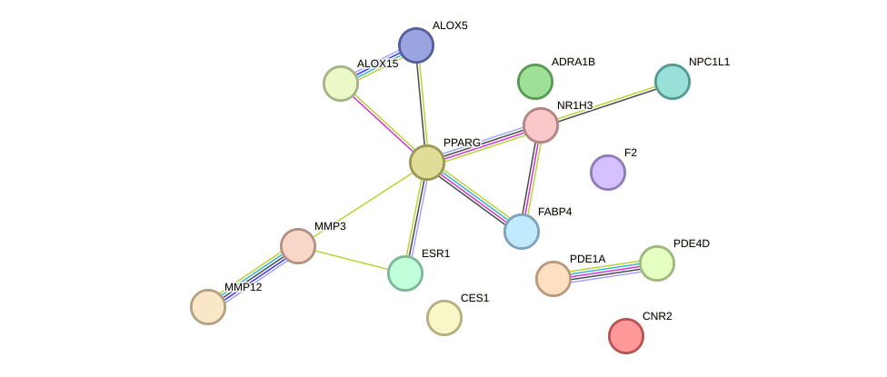
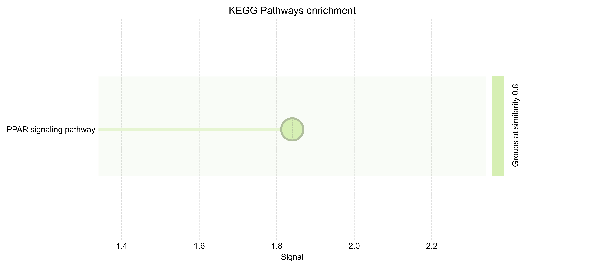
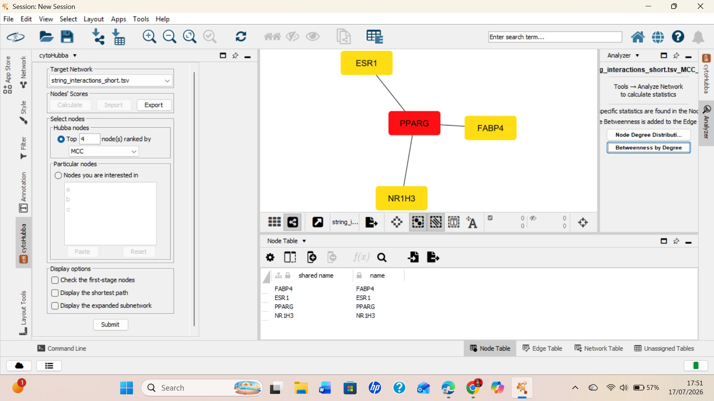
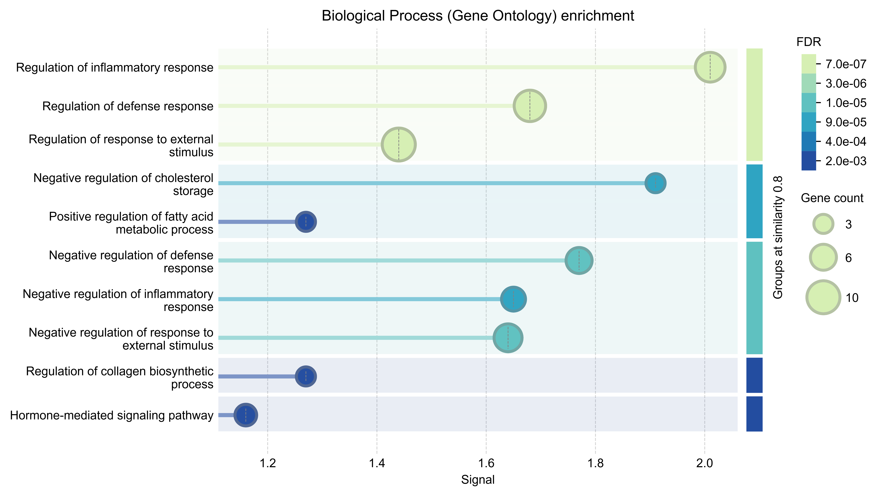
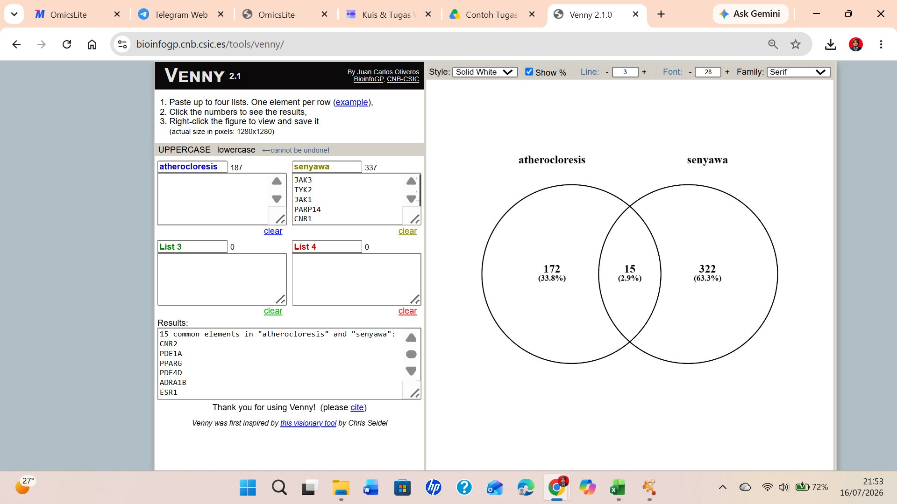

# Laporan Interpretasi Hasil

## Analisis Network Pharmacology Senyawa Aktif Scutellariae Radix–Coptidis Rhizoma (QLYD) terhadap Penyakit Atherosclerosis

*Gambar 1. Diagram alur (workflow) analisis network pharmacology yang digunakan*

Atherosclerosis (AS) merupakan penyakit arteri kronis yang menjadi penyebab utama kematian akibat penyakit kardiovaskular dan serebrovaskular secara global, dengan inflamasi yang berperan penting di setiap tahap perkembangannya. Kombinasi herbal Scutellariae Radix-Coptidis Rhizoma, dikenal sebagai QLYD, yang mengandung senyawa aktif seperti baicalein dan wogonin dari *Scutellaria baicalensis* serta berberine dan canadine dari *Coptis chinensis*, telah lama digunakan dalam Traditional Chinese Medicine untuk menangani AS berkat sifat anti-inflamasi dan regulasi metabolisme lipidnya (Ji et al., 2023). Dalam analisis ini ditambahkan pula quercetin dan beta-sitosterol sebagai senyawa fitokimia pendukung yang umum ditemukan pada tanaman herbal serupa. Meski aktivitas farmakologis senyawa-senyawa ini terhadap AS telah dilaporkan, mekanisme molekuler multi-target yang mendasarinya masih perlu dipetakan secara sistemik.

Analisis ini bertujuan mengidentifikasi target protein utama dari enam senyawa aktif QLYD, yaitu quercetin, wogonin, beta-sitosterol, baicalein, canadine, dan berberine, serta mengungkap hub protein sentral dan jalur biologis yang mendasari mekanisme kerjanya terhadap Atherosclerosis.

Keenam senyawa diidentifikasi melalui PubChem dan diprediksi target proteinnya menggunakan SwissTargetPrediction, menghasilkan 337 target unik gabungan (Tabel 1). Daftar gen terkait Atherosclerosis diperoleh dari OMIM sebanyak 187 gen. Kedua daftar target tersebut diirisankan menggunakan Venny 2.1 untuk memperoleh target potensial yang relevan. Protein-Protein Interaction Network dari gen irisan dikonstruksi melalui STRING dengan confidence minimal 0,400 dan dianalisis di Cytoscape menggunakan plugin cytoHubba untuk identifikasi hub protein. Analisis pengayaan Gene Ontology dan KEGG pathway dilakukan terhadap gen irisan menggunakan ShinyGO pada similarity 0,8 untuk mengungkap proses biologis dan jalur yang terlibat.

### Tabel 1. Target Protein Hasil SwissTargetPrediction

| No. | Senyawa | Jumlah Target Valid | Sumber Data |
|---|---|---|---|
| 1 | Quercetin | 98 | SwissTargetPrediction |
| 2 | Wogonin | 93 | SwissTargetPrediction |
| 3 | Beta-sitosterol | 90 | SwissTargetPrediction |
| 4 | Baicalein | 95 | SwissTargetPrediction |
| 5 | Canadine | 94 | SwissTargetPrediction |
| 6 | Berberine | 96 | SwissTargetPrediction |

*Catatan: setelah digabung dan dihilangkan duplikatnya, keenam senyawa menghasilkan 337 target protein unik (senyawa target gabungan).*

### Target Penyakit Hasil OMIM

Pencarian pada database OMIM dengan kata kunci "Atherosclerosis" menghasilkan 187 gen terkait penyakit, yang selanjutnya digunakan sebagai daftar target penyakit dalam analisis irisan (Gambar 2).

*Gambar 2. Irisan gen target Atherosclerosis (187 gen) dan target senyawa QLYD (337 gen) menggunakan Venny 2.1*

Analisis menggunakan diagram Venn (Gambar 2) menunjukkan 187 gen terkait Atherosclerosis beririsan dengan 337 target gabungan keenam senyawa QLYD, menghasilkan 15 gen irisan (2,9%), yaitu **ALOX5, ALOX15, ADRA1B, NR1H3, NPC1L1, PPARG, MMP3, MMP12, ESR1, FABP4, F2, PDE1A, PDE4D, CES1, dan CNR2**. Kelima belas gen ini mengindikasikan potensi senyawa QLYD dalam memodulasi jalur biologis yang berkaitan dengan patofisiologi Atherosclerosis, khususnya metabolisme lipid dan regulasi reseptor nuklir.

*Gambar 3. Jaringan Protein-Protein Interaction (PPI) dari 15 gen irisan hasil konstruksi STRING*

*Gambar 4. Komponen jaringan yang saling terhubung (ESR1, PPARG, FABP4, NR1H3) hasil visualisasi Cytoscape*

*Gambar 5. Identifikasi hub protein menggunakan plugin cytoHubba metode MCC – PPARG (merah) sebagai hub gene teratas*

Daftar 15 gen irisan tersebut dimasukkan ke platform STRING untuk konstruksi jaringan PPI (Gambar 3). Sebagian besar gen, seperti NPC1L1, MMP12, CES1, dan CNR2, tampil sebagai node terisolasi tanpa interaksi langsung, sementara satu komponen jaringan yang saling terhubung terbentuk oleh empat gen, yaitu ESR1, PPARG, FABP4, dan NR1H3, dengan total 4 node dan 3 edge (Gambar 4). Identifikasi hub protein pada komponen jaringan ini dilakukan menggunakan plugin cytoHubba dengan metode MCC (Gambar 5), dan **PPARG teridentifikasi sebagai hub gene teratas** dengan 3 koneksi langsung terhadap ESR1, FABP4, dan NR1H3, yang masing-masing memiliki 1 koneksi. Hal ini mengindikasikan PPARG berperan sentral dalam menghubungkan target-target senyawa QLYD pada jaringan Atherosclerosis. Sebagai validasi tambahan, analisis degree centrality pada jaringan gabungan target senyawa-penyakit yang lebih luas turut menempatkan ESR1 (degree 44, peringkat 11) dan PPARG (degree 38, peringkat 20) di antara gen dengan jumlah koneksi tertinggi (Tabel 3), memperkuat indikasi peran sentral kedua gen tersebut.

### Tabel 2. Hub Protein pada Komponen Jaringan Irisan (15 Gen)

| Gen | Degree (jumlah koneksi langsung) | Peringkat cytoHubba (MCC) |
|---|---|---|
| PPARG | 3 | 1 |
| ESR1 | 1 | 2 |
| FABP4 | 1 | 2 |
| NR1H3 | 1 | 2 |

### Tabel 3. Validasi Tambahan – 10 Gen dengan Degree Tertinggi pada Jaringan Gabungan Target Senyawa-Penyakit

| Rank | Gen | Degree Score |
|---|---|---|
| 1 | IL6 | 73.0 |
| 2 | TNF | 68.0 |
| 3 | SRC | 67.0 |
| 4 | EGFR | 64.0 |
| 4 | INS | 64.0 |
| 6 | CTNNB1 | 60.0 |
| 7 | ALB | 58.0 |
| 7 | AKT1 | 58.0 |
| 9 | TLR4 | 49.0 |
| 10 | APOB | 46.0 |

*Catatan: ESR1 (degree 44) dan PPARG (degree 38) juga muncul pada jaringan gabungan ini di peringkat 11 dan 20.*

*Gambar 6. Hasil enrichment analysis Gene Ontology Biological Process terhadap 15 gen irisan*

*Gambar 7. Hasil enrichment analysis Gene Ontology Molecular Function terhadap 15 gen irisan*

*Gambar 8. Hasil enrichment analysis KEGG Pathway terhadap 15 gen irisan*

Hasil analisis pengayaan Gene Ontology Biological Process (Gambar 6) menunjukkan keterlibatan gen irisan dalam *regulation of inflammatory response*, *regulation of defense response*, *negative regulation of cholesterol storage*, *positive regulation of fatty acid metabolic process*, dan *hormone-mediated signaling pathway*. Pada kategori Molecular Function (Gambar 7), ditemukan pengayaan signifikan pada *nuclear receptor activity*, *lipid binding*, dan *long-chain fatty acid binding*, sejalan dengan keberadaan PPARG, ESR1, dan NR1H3 sebagai reseptor nuklir serta FABP4 sebagai protein pengikat asam lemak. Sementara itu, analisis KEGG pathway (Gambar 8) mengidentifikasi satu jalur yang signifikan, yaitu **PPAR signaling pathway**, yang secara langsung melibatkan PPARG sebagai komponen utamanya.

Secara keseluruhan, hasil ini menunjukkan bahwa mekanisme molekuler senyawa aktif QLYD dalam memengaruhi Atherosclerosis berpusat pada modulasi reseptor nuklir dan metabolisme lipid melalui jalur PPAR signaling pathway. PPARG, sebagai hub protein utama, berperan mengatur diferensiasi makrofag dan efflux kolesterol sehingga berpotensi menghambat pembentukan sel busa pada dinding arteri, salah satu tahap kunci awal Atherosclerosis. Keterlibatan ESR1 dan NR1H3 sebagai Liver X Receptor alpha memperkuat peran senyawa QLYD dalam regulasi homeostasis kolesterol, sementara FABP4 menghubungkan jaringan ini dengan metabolisme asam lemak yang erat kaitannya dengan akumulasi lipid pada plak aterosklerotik. Didukung oleh temuan enrichment pada regulasi respons inflamasi dan regulasi negatif penyimpanan kolesterol, dapat disimpulkan bahwa senyawa QLYD, yaitu quercetin, wogonin, beta-sitosterol, baicalein, canadine, dan berberine, berpotensi menghambat perkembangan Atherosclerosis melalui kerja multi-target pada jalur reseptor nuklir-lipid dan penekanan inflamasi vaskular, konsisten dengan sifat multi-komponen, multi-target, multi-pathway yang menjadi ciri khas terapi herbal Traditional Chinese Medicine.

## Referensi

Ji, L., Song, T., Ge, C., Wu, Q., Ma, L., Chen, X., Chen, T., Chen, Q., Chen, Z., & Chen, W. (2023). Identification of bioactive compounds and potential mechanisms of Scutellariae Radix-Coptidis Rhizoma in the treatment of atherosclerosis by integrating network pharmacology and experimental validation. *Biomedicine & Pharmacotherapy*, *165*, 115210. https://doi.org/10.1016/j.biopha.2023.115210
