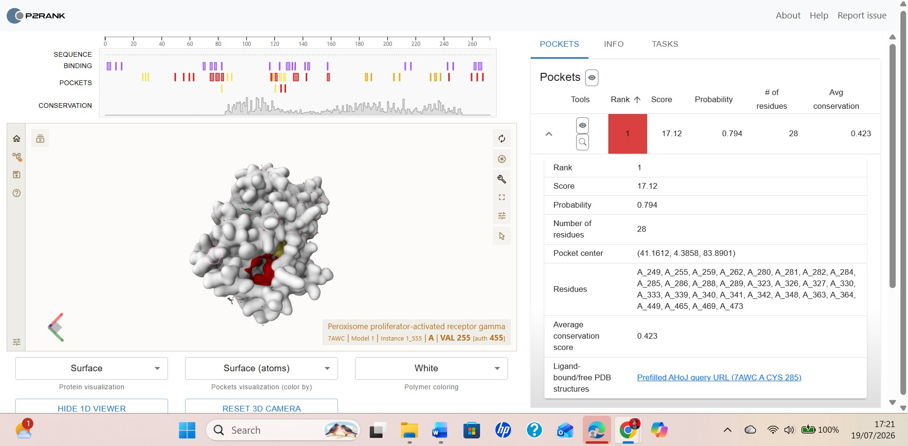
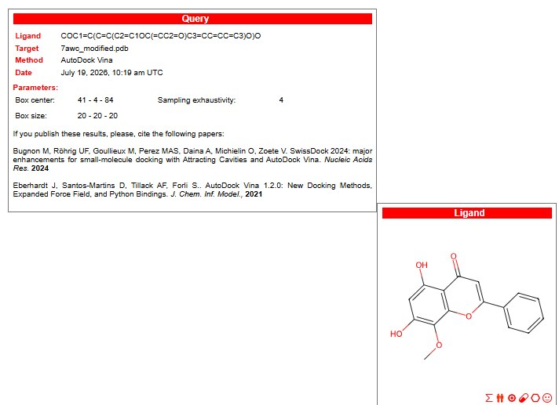
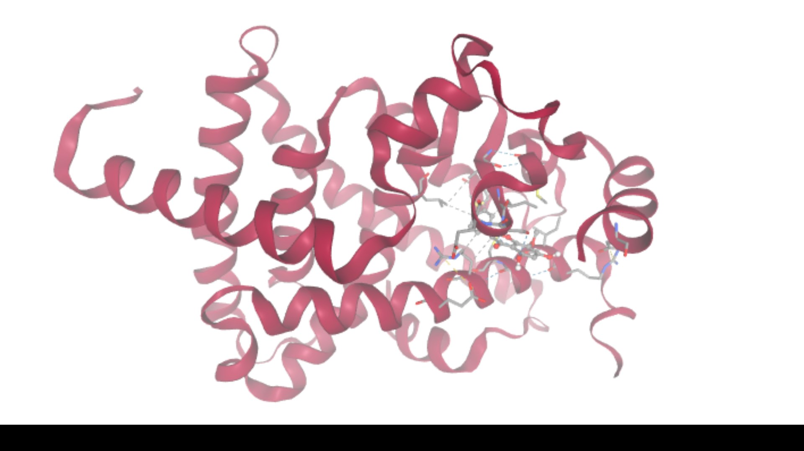

# Molecular Docking PPARG (Peroxisome Proliferator-Activated Receptor Gamma) dan Wogonin

Dalam kelanjutan analisis network pharmacology pada Week 2, PPARG (Peroxisome Proliferator-Activated Receptor Gamma) teridentifikasi sebagai hub protein sentral dari 15 gen irisan target senyawa Scutellariae Radix-Coptidis Rhizoma (QLYD) terhadap Atherosclerosis, dengan keterlibatan langsung pada PPAR signaling pathway hasil enrichment analysis. Pada tugas ini, saya melanjutkan temuan tersebut dengan melakukan molecular docking antara PPARG dan salah satu senyawa QLYD, yaitu Wogonin, sebuah flavonoid dari *Scutellaria baicalensis*. PPARG dipilih karena perannya sebagai reseptor nuklir kunci dalam regulasi diferensiasi adiposit, homeostasis lipid, dan polarisasi makrofag M2 yang bersifat anti-inflamasi, menjadikannya target penting dalam pencegahan pembentukan sel busa pada dinding arteri, salah satu tahap awal patogenesis Atherosclerosis.

Studi terbaru oleh Ma et al. (2025) melaporkan bahwa wogonin mampu menghambat perkembangan Atherosclerosis pada model tikus dengan mereprogram metabolisme makrofag dari glikolisis menuju fatty acid oxidation melalui aktivasi jalur PPARα-KLF11-YAP1, sekaligus meningkatkan efluks kolesterol melalui ABCA1/G1 dan menekan pembentukan sel busa. Mengingat PPARα dan PPARG merupakan anggota famili reseptor nuklir PPAR yang berbagi kemiripan struktural pada domain pengikatan ligan, docking wogonin terhadap PPARG pada studi ini dilakukan untuk mengeksplorasi kemungkinan interaksi langsung wogonin dengan isoform gamma, melengkapi bukti aktivitas wogonin pada isoform alpha yang telah dilaporkan secara eksperimental.

### Tabel 1. Informasi Protein Target dan Ligan

| Kategori | Keterangan |
|---|---|
| Protein Target | Peroxisome Proliferator-Activated Receptor Gamma (PPARG) |
| PDB ID | 7AWC |
| Metode / Resolusi | X-ray diffraction, 1,74 Å |
| Kompleks kristal asli | PPARG dengan Rosiglitazone (agonis PPARG) |
| Rantai digunakan | Chain A (residu 231–505) |
| Ligan uji | Wogonin (PubChem CID: 5281703) |
| Rumus molekul ligan | C16H12O5 |
| SMILES | `COC1=C(C=C(C2=C1OC(=CC2=O)C3=CC=CC=C3)O)O` |

Langkah awal dilakukan dengan mencari struktur kristal PPARG di RCSB PDB, diperoleh entri 7AWC hasil difraksi sinar-X pada resolusi 1,74 Å yang merepresentasikan kompleks PPARG dengan rosiglitazone, agonis PPARG klasik. Struktur SMILES wogonin diperoleh dari PubChem dengan CID 5281703. Penentuan binding site dilakukan melalui PrankWeb, yang mengidentifikasi tiga kantong potensial pada struktur PPARG. Pocket peringkat pertama menunjukkan skor tertinggi 17,12 dengan probabilitas 0,794, melibatkan 28 residu, dan titik pusat koordinat (41,1612; 4,3858; 83,8901), yang selanjutnya digunakan sebagai search box pada proses docking (Gambar 1).

*Gambar 1. Identifikasi binding pocket PPARG melalui PrankWeb – pocket peringkat 1 (skor 17,12; probabilitas 0,794; 28 residu)*

### Konfigurasi Docking

| Parameter | Nilai |
|---|---|
| Platform | SwissDock 2024 |
| Metode docking | AutoDock Vina 1.2.0 |
| Heteroatom target | None (ligan bawaan & air dihilangkan) |
| Box center (x, y, z) | 41, 4, 84 |
| Box size (x, y, z) | 20, 20, 20 Å |
| Sampling exhaustivity | 4 |

Proses docking dilakukan sepenuhnya melalui platform SwissDock 2024 (Bugnon et al., 2024) dengan metode AutoDock Vina 1.2.0 (Eberhardt et al., 2021) sebagai algoritma backend. SMILES wogonin dimasukkan pada kolom Submit a ligand dan disiapkan menggunakan fitur Prepare ligand. Struktur target diunggah dalam format PDB dengan opsi heteroatom "None" untuk menghilangkan ligan bawaan rosiglitazone dan molekul air agar pocket tetap steril. Search box diatur pada koordinat pusat (41, 4, 84) dengan ukuran 20×20×20 Å dan sampling exhaustivity 4, mengikuti hasil prediksi PrankWeb (Gambar 2).

*Gambar 2. Ringkasan query dan parameter docking pada SwissDock, beserta struktur 2D ligan wogonin*

### Tabel 2. Hasil Afinitas Molecular Docking

| Model | Calculated Affinity (kcal/mol) |
|---|---|
| 1 | -6.887 |
| 2 | -6.756 |
| 3 | -6.708 |
| 4 | -6.517 |
| 5 | -6.482 |
| 6 | -6.416 |
| 7 | -6.186 |
| 8 | -5.684 |
| 9 | -5.303 |
| 10 | -5.005 |
| 11 | -4.180 |

Simulasi menghasilkan 11 model konformasi (Tabel 2). Model 1 memberikan nilai Calculated Affinity terbaik sebesar -6,887 kcal/mol, diikuti model 2 dan 3 dengan nilai -6,756 dan -6,708 kcal/mol. Nilai afinitas ini tergolong sedang, lebih rendah dibandingkan afinitas khas agonis sintetis seperti rosiglitazone, namun tetap mengindikasikan potensi wogonin untuk berikatan pada domain pengikatan ligan PPARG. Visualisasi pose docking (Gambar 3) menunjukkan wogonin menempati rongga hidrofobik pada domain pengikatan ligan PPARG, dengan pembentukan beberapa ikatan hidrogen terhadap residu di sekitar pocket, mengindikasikan kemungkinan stabilisasi kompleks protein-ligan meskipun tidak sekuat agonis penuh seperti rosiglitazone.

*Gambar 3. Visualisasi pose Wogonin (model 1) di dalam domain pengikatan ligan PPARG, menunjukkan ikatan hidrogen (garis putus-putus) dengan residu pocket*

Hasil docking ini melengkapi temuan Week 2 yang mengidentifikasi PPARG sebagai hub protein sentral pada jaringan target senyawa QLYD terhadap Atherosclerosis. Meskipun afinitas ikatan wogonin terhadap PPARG tergolong moderat, temuan ini bersama laporan Ma et al. (2025) mengenai aktivitas wogonin pada PPARα memperkuat indikasi bahwa wogonin bekerja sebagai modulator multi-target pada famili reseptor PPAR, berkontribusi pada regulasi metabolisme lipid dan penekanan inflamasi vaskular. Validasi lebih lanjut melalui simulasi molecular dynamics dan uji in vitro diperlukan untuk memastikan stabilitas interaksi serta aktivitas fungsional wogonin sebagai modulator PPARG.

## Referensi

Ma, C., Hua, Y., Yang, S., Zhao, Y., Zhang, W., Miao, Y., Zhang, J., Feng, B., Zheng, G., Li, L., Liu, Z., Zhang, H., Zhu, M., Gao, X., & Fan, G. (2025). Wogonin attenuates atherosclerosis via KLF11-mediated suppression of PPARα-YAP1-driven glycolysis and enhancement of ABCA1/G1-mediated cholesterol efflux. *Advanced Science*, *12*(23), 2500610. https://doi.org/10.1002/advs.202500610

Bugnon, M., Röhrig, U. F., Goullieux, M., Perez, M. A. S., Daina, A., Michielin, O., & Zoete, V. (2024). SwissDock 2024: major enhancements for small-molecule docking with Attracting Cavities and AutoDock Vina. *Nucleic Acids Research*, *52*(W1), W324–W332. https://doi.org/10.1093/nar/gkae300

Eberhardt, J., Santos-Martins, D., Tillack, A. F., & Forli, S. (2021). AutoDock Vina 1.2.0: New docking methods, expanded force field, and Python bindings. *Journal of Chemical Information and Modeling*, *61*(8), 3891–3898. https://doi.org/10.1021/acs.jcim.1c00203
