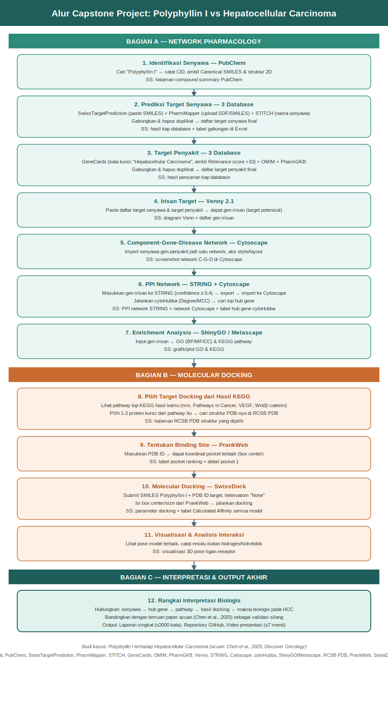
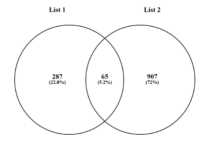
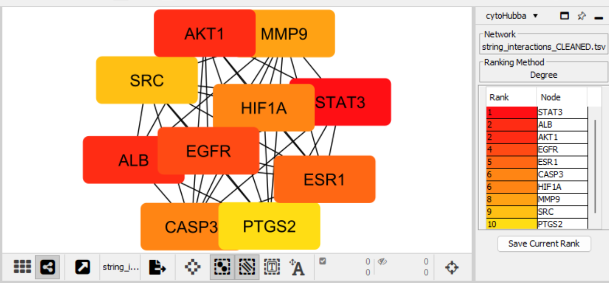
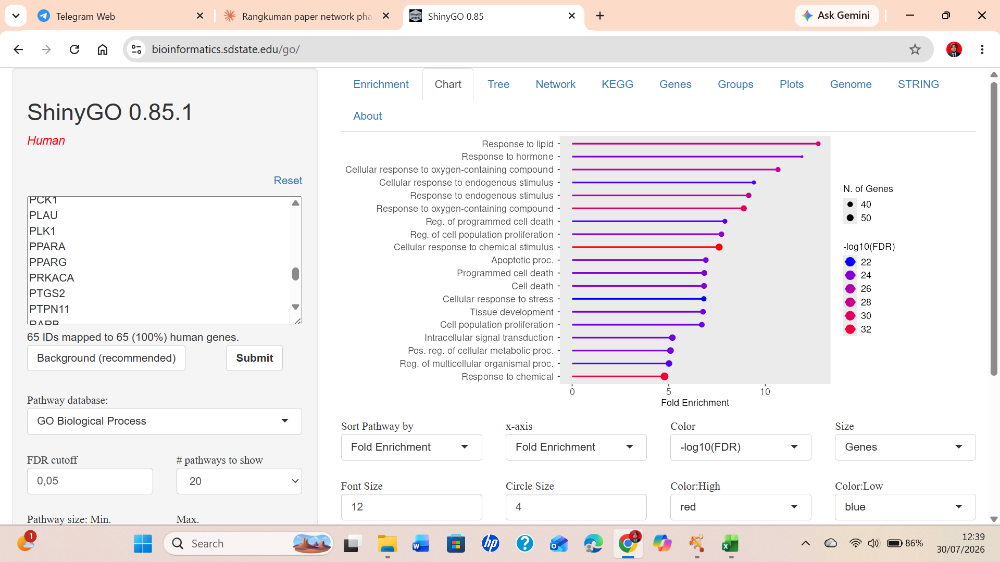
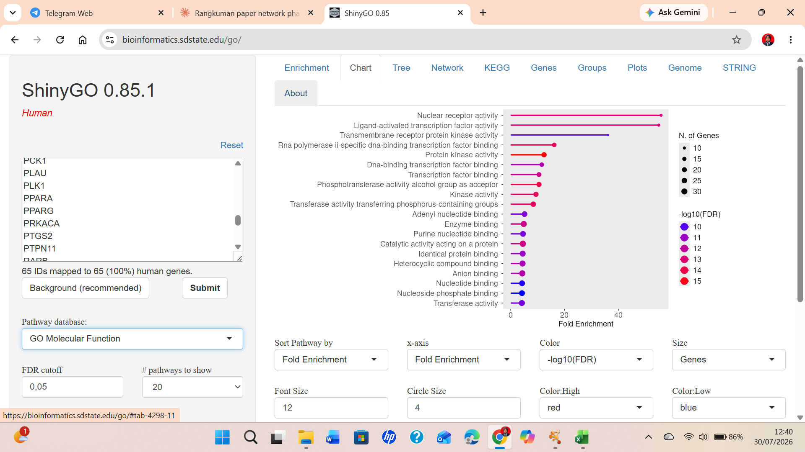
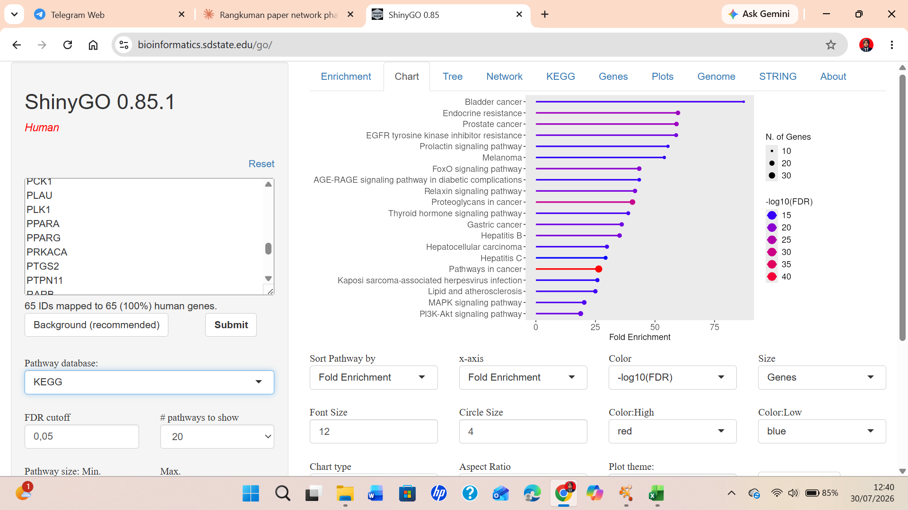
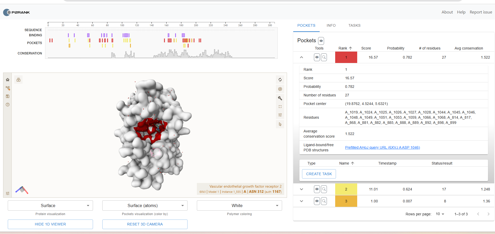
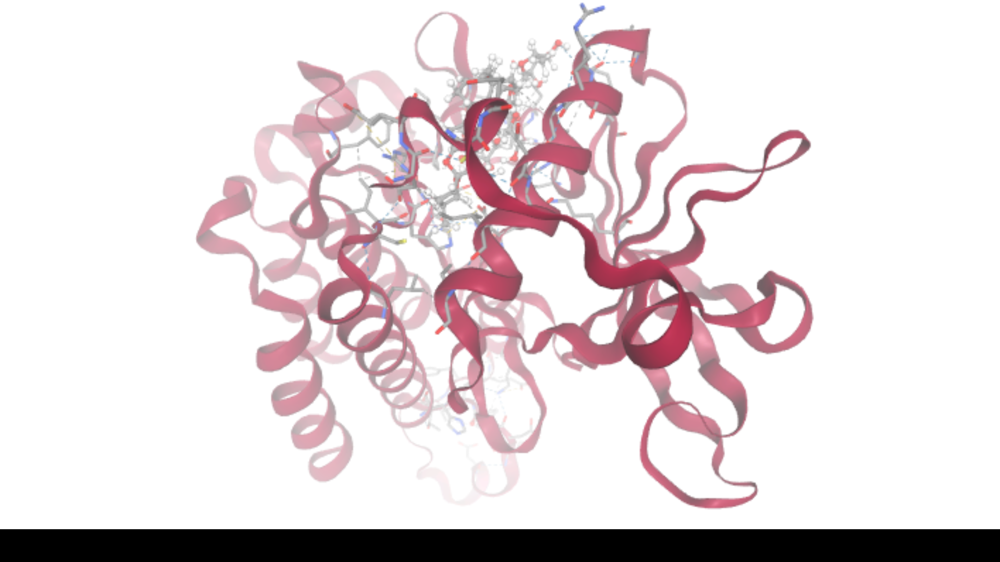

# Laporan Singkat Capstone Project

## Eksplorasi Mekanisme Molekuler Polyphyllin I terhadap Hepatocellular Carcinoma melalui Pendekatan Network Pharmacology dan Molecular Docking

*Gambar 1. Diagram alur (workflow) analisis network pharmacology dan molecular docking*

## Pendahuluan

Hepatocellular carcinoma (HCC) merupakan subtipe kanker hati primer paling umum, menyumbang sekitar 75-85% dari seluruh kasus kanker hati di dunia, dan menjadi salah satu penyebab kematian akibat kanker terbesar secara global. Terapi target yang telah disetujui FDA seperti sorafenib dan lenvatinib masih menghadapi keterbatasan berupa efikasi yang kurang optimal, efek samping berat, dan resistensi obat, sehingga diperlukan kandidat terapeutik baru yang lebih aman dan efektif.

Polyphyllin I, saponin steroid aktif dari *Paris polyphylla*, telah dilaporkan memiliki aktivitas antitumor pada berbagai jenis kanker termasuk HCC, baik secara in vitro maupun in vivo. Namun demikian, mekanisme molekuler Polyphyllin I dalam menghambat HCC masih belum dipahami secara menyeluruh, mengingat sifat senyawa alam yang umumnya bekerja secara multi-target pada berbagai jalur biologis sekaligus.

Studi ini bertujuan mengeksplorasi mekanisme molekuler Polyphyllin I terhadap HCC melalui pendekatan network pharmacology dan molecular docking, dengan mereplikasi dan mengembangkan lebih lanjut metodologi yang dilaporkan oleh Chen dkk. (2025). Fokus analisis meliputi identifikasi target protein, hub gene sentral, jalur biologis melalui enrichment analysis, serta validasi interaksi molekuler terhadap salah satu target kunci melalui simulasi docking independen.

## Metode

**Identifikasi Senyawa dan Target.** Struktur dan kode SMILES Polyphyllin I (PubChem CID 11018329) diperoleh dari PubChem. Target protein senyawa diprediksi menggunakan tiga platform: SwissTargetPrediction, PharmMapper, dan STITCH. Hasil PharmMapper yang berupa Uniprot mnemonic ID dikonversi menjadi simbol gen resmi menggunakan UniProt ID Mapping. Ketiga hasil digabungkan dan diduplikasi menjadi daftar target senyawa final.

**Identifikasi Target Penyakit dan Irisan Target.** Gen terkait HCC dikumpulkan dari GeneCards (Relevance Score > 10), OMIM, dan PharmGKB, kemudian digabungkan dan diduplikasi menjadi daftar target penyakit final. Kedua daftar target diirisankan menggunakan Venny 2.1.

**Konstruksi Jaringan PPI dan Hub Gene.** Gen irisan dimasukkan ke STRING (confidence ≥ 0,4) untuk membangun jaringan protein-protein interaction, divisualisasikan di Cytoscape. Hub gene diidentifikasi menggunakan plugin cytoHubba dengan metode Degree.

**Enrichment Analysis.** Analisis pengayaan Gene Ontology (Biological Process, Molecular Function) dan KEGG Pathway dilakukan terhadap gen irisan menggunakan ShinyGO.

**Molecular Docking.** Berdasarkan hasil hub gene dan enrichment pathway, dipilih KDR (VEGFR2) sebagai target docking. Struktur kristal KDR diperoleh dari RCSB PDB (PDB: 6XVJ, resolusi 1,78 Å). Binding site ditentukan menggunakan PrankWeb. Docking dilakukan menggunakan SwissDock dengan metode Attracting Cavities 2.0.

## Hasil dan Interpretasi

### Target Senyawa dan Target Penyakit

| Kategori | Sumber | Jumlah Gen |
|---|---|---|
| Target Senyawa | SwissTargetPrediction | 93 |
| Target Senyawa | PharmMapper (setelah mapping UniProt) | 285 |
| Target Senyawa | STITCH | 0 (tidak ditemukan) |
| Target Senyawa | **Gabungan unik** | **352** |
| Target Penyakit | GeneCards (Relevance Score > 10) | 833 |
| Target Penyakit | OMIM | 193 |
| Target Penyakit | PharmGKB | 12 |
| Target Penyakit | **Gabungan unik** | **972** |

*Gambar 2. Irisan target senyawa Polyphyllin I (352 gen) dan target penyakit HCC (972 gen) menggunakan Venny 2.1*

Irisan menghasilkan **65 gen target potensial**: ABCB1, AKT1, ALB, ALDH2, AR, CASP3, CBR1, CCNA2, CDK2, CDK6, CHEK1, DNMT3A, EGFR, EPHB4, ESR1, F2, FGFR1, FGFR2, GSK3B, GSTP1, HIF1A, HRAS, IDH1, IGF1, IGF1R, KDR, KEAP1, LGALS3, MAP2K1, MAPK1, MAPK14, MAPK8, MDM2, MET, MMP1, MMP2, MMP9, NOS3, NOTCH1, NQO1, NR1H4, NR1I2, PARP1, PCK1, PLAU, PLK1, PPARA, PPARG, PRKACA, PTGS2, PTPN11, RARB, RXRA, SERPINA1, SRC, STAT1, STAT3, TERT, TGFBR1, TGFBR2, TLR4, TYMP, TYMS, VDR, dan XIAP.

### Jaringan PPI dan Hub Gene

Konstruksi jaringan PPI dari 65 gen irisan pada STRING menghasilkan 64 gen yang saling terhubung dengan 878 interaksi; satu gen (VDR) tidak menunjukkan interaksi dengan gen lain pada ambang confidence tersebut.

*Gambar 3. Jaringan PPI dan hasil ranking hub gene menggunakan cytoHubba (metode Degree)*

| Rank | Gen |
|---|---|
| 1 | STAT3 |
| 2 (=) | ALB |
| 2 (=) | AKT1 |
| 4 | EGFR |
| 5 | ESR1 |
| 6 (=) | CASP3 |
| 6 (=) | HIF1A |
| 8 | MMP9 |
| 9 | SRC |
| 10 | PTGS2 |

Temuan ini konsisten dengan paper acuan, yang mengidentifikasi PTGS2, MMP9, CASP3, dan EGFR sebagai bagian dari sepuluh hub gene teratas mereka meskipun daftar dan urutan peringkatnya sedikit berbeda, wajar mengingat pembaruan basis data dari waktu ke waktu.

### Enrichment Analysis

*Gambar 4. Hasil enrichment Gene Ontology Biological Process*

*Gambar 5. Hasil enrichment Gene Ontology Molecular Function*

*Gambar 6. Hasil enrichment KEGG Pathway*

Hasil GO Biological Process menunjukkan keterlibatan gen irisan dalam *response to lipid*, *response to hormone*, *regulation of programmed cell death*, dan *apoptotic process*. Molecular Function didominasi oleh *nuclear receptor activity* dan *ligand-activated transcription factor activity*, sejalan dengan banyaknya reseptor nuklir pada gen irisan (PPARG, PPARA, RXRA, ESR1, AR, NR1H4, NR1I2, RARB).

Analisis KEGG Pathway mengidentifikasi **Pathways in Cancer** sebagai jalur paling signifikan, diikuti **Hepatocellular carcinoma** sebagai pathway tersendiri, serta PI3K-Akt signaling pathway dan MAPK signaling pathway — konsisten dengan hasil KEGG pada paper acuan.

### Molecular Docking

Analisis PrankWeb pada struktur KDR (PDB 6XVJ) mengidentifikasi pocket pertama dengan skor 16,57, probabilitas 0,782, melibatkan 27 residu, pusat koordinat (19,8762; 4,5244; 5,6321).

*Gambar 7. Identifikasi binding site KDR (VEGFR2) melalui PrankWeb*

Simulasi docking menggunakan SwissDock (metode Attracting Cavities 2.0) menghasilkan 50 model konformasi:

| Cluster | SwissParam Score (kkal/mol) |
|---|---|
| **#9 (terbaik)** | **-9,1675** |
| #32 | -8,7028 |
| #6 | -8,6256 |
| #26 | -8,5936 |
| #18 | -8,5555 |

Model terbaik (cluster #9) menunjukkan SwissParam Score sebesar **-9,1675 kkal/mol**, secara substansial lebih negatif dibandingkan ambang batas -6,0 kkal/mol yang digunakan paper acuan untuk menyatakan afinitas ikatan kuat, mengindikasikan Polyphyllin I berpotensi memiliki afinitas ikatan yang kuat terhadap reseptor VEGFR2.

*Gambar 8. Visualisasi pose docking terbaik (cluster #9) Polyphyllin I pada domain kinase KDR (VEGFR2)*

### Sintesis Interpretasi

Secara keseluruhan, hasil ini menunjukkan bahwa mekanisme molekuler Polyphyllin I dalam menghambat HCC kemungkinan besar bersifat multi-target, melibatkan modulasi hub gene sentral (STAT3, EGFR, AKT1, CASP3, HIF1A, MMP9, PTGS2) yang berperan dalam proliferasi, apoptosis, dan inflamasi sel kanker. Keterlibatan jalur *Pathways in Cancer*, *Hepatocellular carcinoma*, dan *PI3K-Akt signaling pathway* memperkuat relevansi klinis temuan terhadap HCC secara spesifik.

Dominannya *nuclear receptor activity* turut mendukung laporan sebelumnya mengenai mekanisme Polyphyllin I melalui jalur ZBTB16/PPARγ/RXRα. Hasil molecular docking terhadap KDR (VEGFR2) dengan afinitas kuat (-9,1675 kkal/mol) memberikan bukti komputasional tambahan bahwa Polyphyllin I berpotensi menghambat jalur VEGF signaling melalui pengikatan langsung terhadap reseptornya, melengkapi temuan paper acuan yang berfokus pada ligan VEGF-C.

**Keterbatasan:** seluruh analisis bersifat in silico tanpa validasi eksperimental langsung; basis data yang terus diperbarui menyebabkan perbedaan jumlah target dibandingkan paper acuan; 12 identifier PharmMapper tidak berhasil dipetakan ke simbol gen resmi karena penamaan usang.

## Kesimpulan

Analisis network pharmacology dan molecular docking terhadap Polyphyllin I dan HCC berhasil mengidentifikasi 65 gen target potensial dengan STAT3, ALB, AKT1, EGFR, dan ESR1 sebagai hub gene sentral. Jalur Pathways in Cancer, Hepatocellular carcinoma, dan PI3K-Akt signaling pathway teridentifikasi sebagai mekanisme kerja utama, konsisten dengan temuan paper acuan. Molecular docking terhadap reseptor VEGFR2 (KDR) menunjukkan afinitas ikatan kuat sebesar -9,1675 kkal/mol, melebihi ambang batas afinitas kuat pada paper acuan, sehingga memperkuat potensi Polyphyllin I sebagai kandidat agen antikanker multi-target pada HCC yang bekerja melalui modulasi proliferasi, apoptosis, inflamasi, dan jalur VEGF signaling. Validasi eksperimental lebih lanjut diperlukan untuk mengonfirmasi temuan komputasional ini.

## Referensi

Chen, Y., Wang, Q., Bian, S., Dong, J., Xiong, J., & Le, J. (2025). Exploration of the mechanism of Polyphyllin I against hepatocellular carcinoma based on network pharmacology, molecular docking and experimental validation. *Discover Oncology*, 16, 941. https://doi.org/10.1007/s12672-025-02341-5

Bugnon, M., Röhrig, U. F., Goullieux, M., Perez, M. A. S., Daina, A., Michielin, O., & Zoete, V. (2024). SwissDock 2024: major enhancements for small-molecule docking with Attracting Cavities and AutoDock Vina. *Nucleic Acids Research*, 52(W1), W324–W332. https://doi.org/10.1093/nar/gkae300
